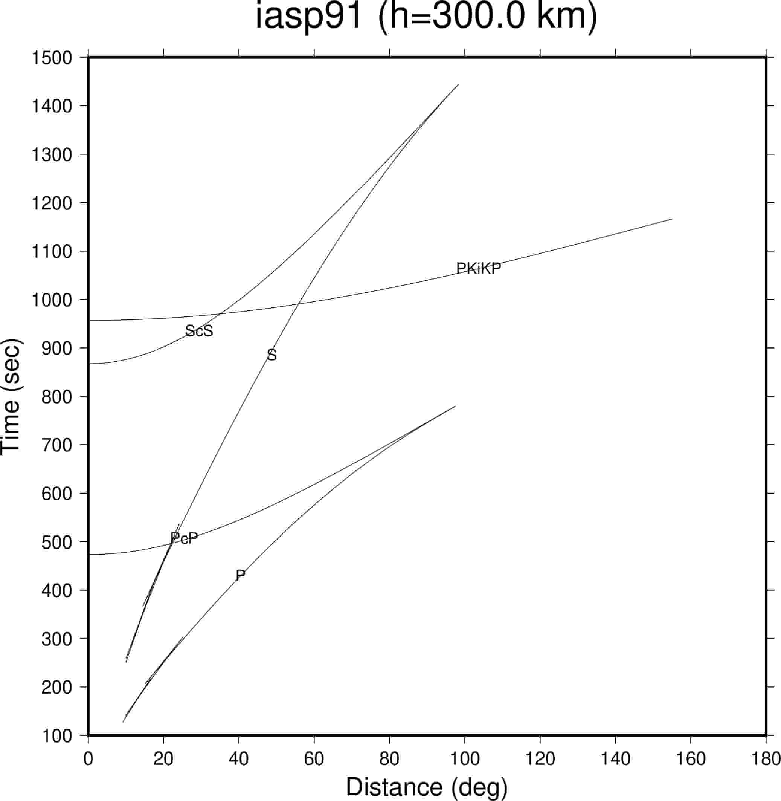

taup curve
==========

:本节贡献者: |田冬冬|\（作者）、
             |姚家园|\（审稿）
:最近更新日期: 2021-05-31

----

``taup curve`` 用于计算并绘制震相的走时曲线（走时—震中距关系曲线）。

基本用法
--------

使用 ``taup curve --help`` 可查询该命令的完整用法和选项。大多数选项的含义与
:doc:`taup_time` 相同，不再赘述。此处仅介绍常用用法。

计算震源深度为 300 km，P、S、PcP、ScS、PKiKP 震相的走时曲线::

    $ taup curve -h 300 -ph P,S,PcP,ScS,PKiKP

该命令会将走时曲线信息以 GMT **plot** 或 **psxy** 命令可识别的格式输出到文件
:file:`taup_curve.gmt` 中。

可以使用 ``-o`` 选项指定输出的文件名或输出到标准输出（屏幕）。例如，下面的第一行命令
会将走时曲线输出到文件 :file:`time_curve.gmt` 中，第二行会输出到屏幕上::

    $ taup_curve -h 300 -ph P,S,PcP,ScS,PKiKP -o time_curve
    $ taup_curve -h 300 -ph P,S,PcP,ScS,PKiKP -o stdout

输出格式
--------

输出的走时曲线用两列数据表示，

- 第一列：震中距（单位为 °）
- 第二列：震相走时（单位为 s）

多个震相的走时曲线之间用 ``>`` 符号分隔，其后接着当前走时曲线所对应的震相信息。

例如，上面命令输出的文件的内容为（仅显示部分）::

    > P for a source depth of 300.0 kilometers in the iasp91 model
     9.10    127.05
    10.99    150.20
    11.10    151.54
    11.21    152.81
    ...
    > S for a source depth of 300.0 kilometers in the iasp91 model
     9.96    250.39
    11.90    294.22
    13.34    326.40
    14.34    348.66
    ...

``taup curve`` 不仅可以输出震相走时，还支持输出折合走时（reduced traveltime）
或相对走时：

- 使用 ``-reddeg`` 选项设置折合速度（reducing velocity），其单位为 °/s
- 使用 ``-redkm`` 选项设置折合速度（reducing velocity），其单位为 km/s
- 使用 ``-rel`` 选定指定某个参考震相，输出相对该参考震相的走时

绘制走时曲线
------------

使用 ``-gmt`` 选项可以生成 GMT 绘图脚本（:file:`taup_curve.gmt`\ ），执行该脚本
即可生成 PDF 格式的射线路径图::

    $ taup_curve -h 300 -ph P,S,PcP,ScS,PKiKP -gmt
    $ sh taup_curve.gmt

.. note::

   ``taup curve`` 命令生成的 GMT 脚本采用的是 GMT 5 语法。GMT 5 和 GMT 6 用户可以
   直接运行使用，而 GMT 4 用户则无法正确运行。

绘制出来的图件效果如下：

