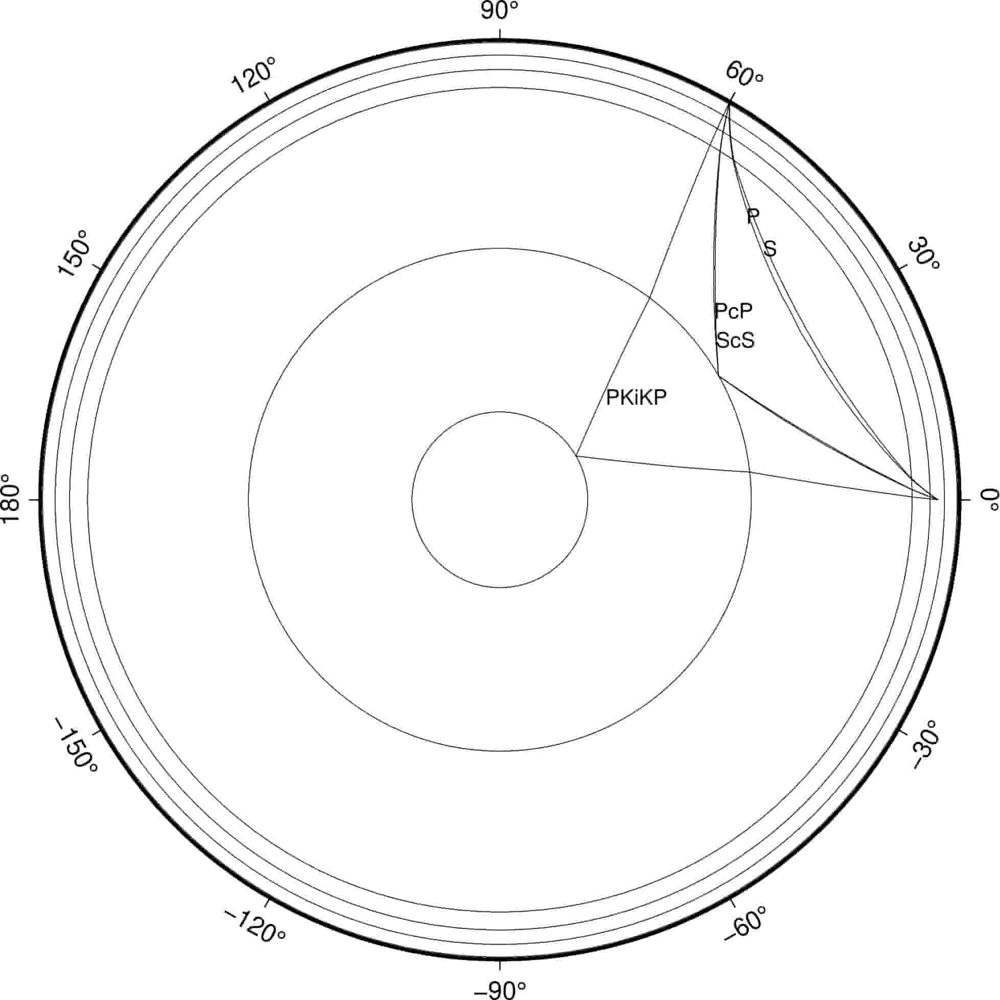

taup_path
=========

:本节贡献者: |田冬冬|\（作者）、
             |姚家园|\（审稿）
:最近更新日期: 2021-01-04

----

``taup_path`` 用于计算并绘制射线的传播路径。

基本用法
--------

使用 ``taup_path -help`` 可查询该命令的完整用法和选项。大多数选项的含义与
:doc:`taup_time` 相同，不再赘述。此处仅介绍常用用法。

计算震源深度为 300 km，震中距 60° 处，P、S、PcP、ScS、PKiKP 震相的射线路径::

    $ taup_path -h 300 -deg 60 -ph P,S,PcP,ScS,PKiKP

该命令会将射线路径信息以 GMT **plot** 或 **psxy** 命令可识别的格式输出到文件
:file:`taup_path.gmt` 中。

可以使用 ``-o`` 选项指定输出的文件名或输出到标准输出（屏幕）。例如，下面的第一行命令
会将射线路径输出到文件 :file:`raypath.gmt` 中，第二行会输出到屏幕上::

    $ taup_path -h 300 -deg 60 -ph P,S,PcP,ScS,PKiKP -o raypath
    $ taup_path -h 300 -deg 60 -ph P,S,PcP,ScS,PKiKP -o stdout

输出格式
---------

输出的射线路径用两列数据表示，

- 第一列：震中距（单位为 °）
- 第二列：射线与地球中心的距离（单位为 km）

多个震相的射线路径之间用 ``>`` 符号分隔，其后接着当前射线路径所对应的震相信息。

例如，上面命令输出的文件的内容为（仅显示部分）::

    > P at 575.40 seconds at 60.00 degrees for a 300.0 km deep source in the iasp91 model with rayParam 6.760 s/deg.
    0.00    6071.0
    0.06    6061.0
    0.07    6059.9
    0.08    6058.8
    ...
    > PcP at 617.92 seconds at 60.00 degrees for a 300.0 km deep source in the iasp91 model with rayParam 4.026 s/deg.
    0.00    6071.0
    0.03    6061.0
    0.04    6059.9
    0.04    6058.8

绘制射线路径
------------

使用 ``-svg`` 选项可以直接绘制 SVG 格式的射线路径图::

    $ taup_path -h 300 -deg 60 -ph P,S,PcP,ScS,PKiKP -svg

使用 ``-gmt`` 选项可以生成 GMT 绘图脚本（:file:`taup_path.gmt`），执行该脚本即可生成 PS 格式的射线路径图::

    $ taup_path -h 300 -deg 60 -ph P,S,PcP,ScS,PKiKP -gmt
    $ sh taup_path.gmt

.. note::

   ``taup_path`` 命令生成的 GMT 脚本采用的是 GMT 4 语法。对于 GMT 5 或 GMT 6 用户，
   可直接将脚本中的 ``psbasemap`` 和 ``psxy`` 改成 ``gmt psbasemap`` 和 ``gmt psxy``
   即可。

绘制出来的图件效果如下：

