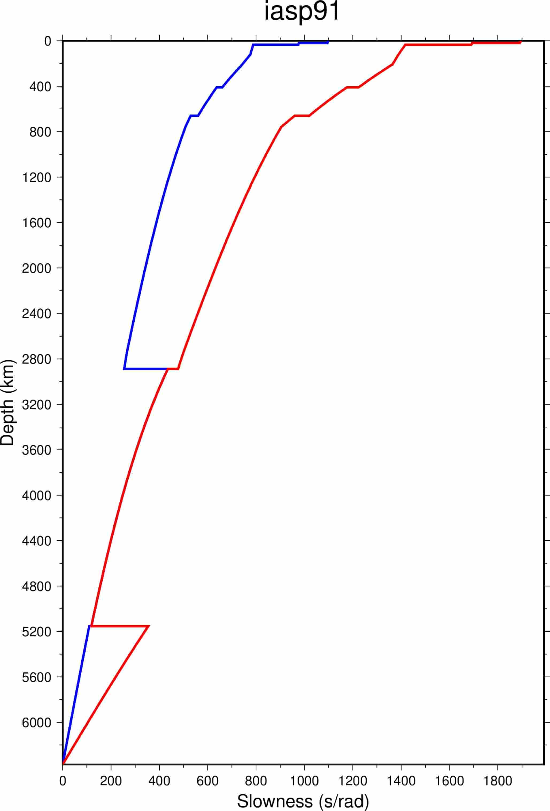

taup slowplot
=============

:本节贡献者: |田冬冬|\（作者）、
             |姚家园|\（审稿）
:最近更新日期: 2021-06-01

----

``taup slowplot`` 可以很方便地生成用于绘制慢度-深度剖面的 GMT 脚本。

慢度定义
---------

此处的慢度定义为 :math:`s = \frac{r}{v}`\ ，单位为 s/rad。在球坐标系下，
射线参数（即水平慢度）的定义为 :math:`p = \frac{r \sin\theta}{v}`\ ，其中
:math:`\theta` 是射线与径向的夹角。在地震波传播过程中，射线参数保持不变。
因此，由于地球不同深度处的半径 r 和速度 v 不同，角度 :math:`\theta` 也会发生变化。
在某一深度处，若 :math:`\theta = 90`\ ，则射线将在该深度折返。
因而慢度-深度模型展示了某个射线参数对应的射线所能采样的最大深度。

基本用法
---------

使用 ``taup slowplot --help`` 可查询该命令的完整用法和选项。此处仅介绍其常用用法。

绘制 iasp91 参考模型的慢度模型::

    $ taup slowplot -mod iasp91

执行该命令会生成脚本 :file:`iasp91_slow.gmt`\ 。执行该脚本即可生成 PDF 格式的速度模型图片::

    $ sh iasp91_slow.gmt

绘制出来的图件效果如下（图中蓝线为 P 波慢度，红线为 S 波慢度）：

例如，射线参数为 400 s/rad 的 P 波的折返深度约为 1500 km，因而无法采样到更深
的地幔以及地核。

.. note::

   需要注意的是，由于外核 S 波速度为 0，所以外核仅允许 P 波通过。上图中，
   在外核深度范围内（2889-5153.9 km），S 波慢度实际上采用的是 P 波慢度。
