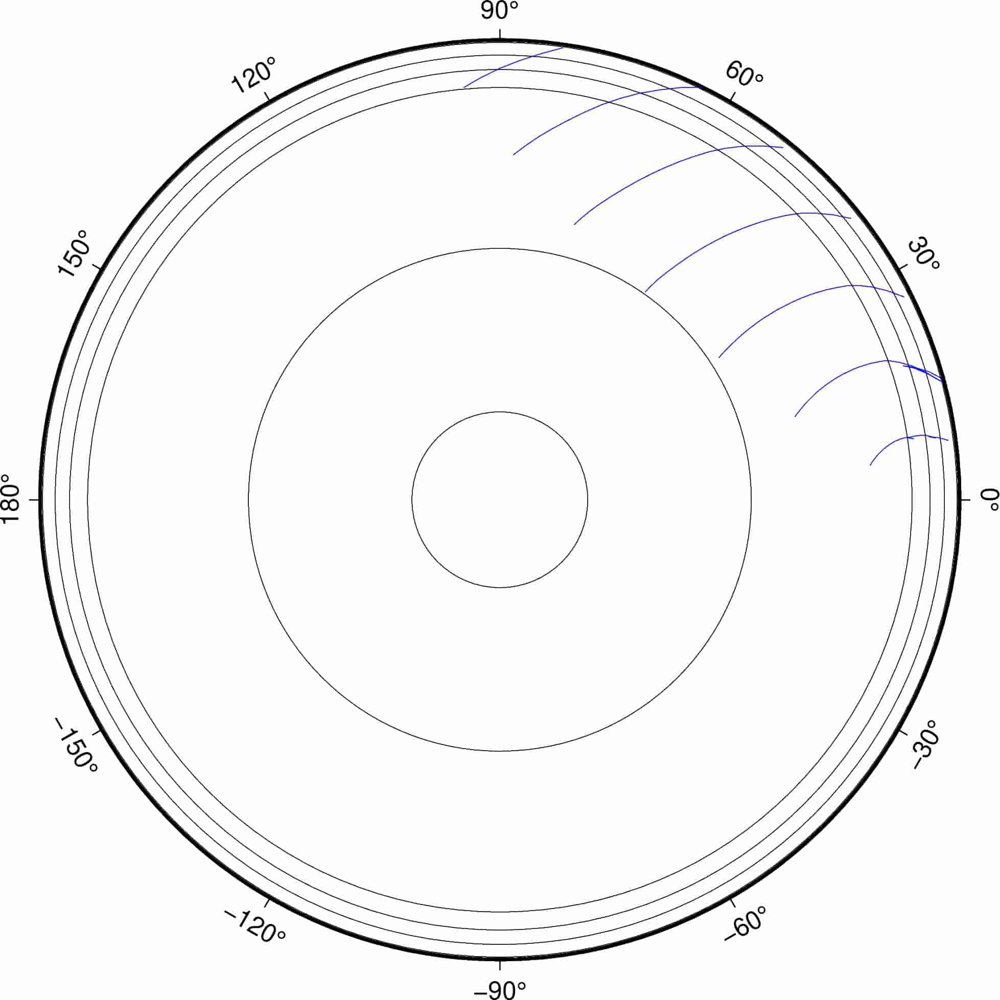
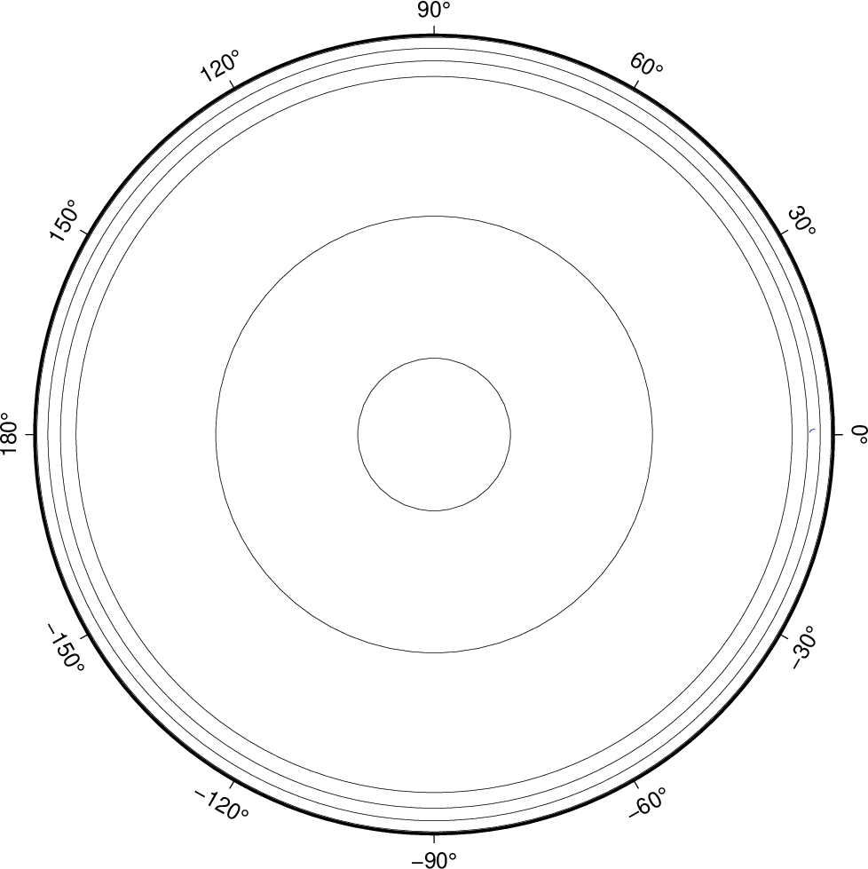

taup wavefront
==============

:本节贡献者: |田冬冬|\（作者）、
             |姚家园|\（审稿）
:最近更新日期: 2021-06-05

----

``taup wavefront`` 命令可用于生成波前面，即任意时刻地震波在地球内部的波场快照。

基本用法
--------

使用 ``taup wavefront --help`` 可查询该命令的完整用法和选项。其选项与
:doc:`taup_time` 几乎完全相同，故不再重复介绍。此处仅介绍常用用法。

计算震源深度为 300 km，震中距 60° 处，P 震相的波前面::

    $ taup wavefront -ph P -deg 60 -h 300

该命令会生成文件 :file:`taup_wavefront.gmt`\ ，其包含了不同时刻（t=100, 200, 300, ...）的
P 波的波前面信息，内容如下::

    > P at 100.0 seconds
    5.31    5151.8   100.00  254.331
    5.42    5158.7   100.00  260.031
    5.49    5163.9   100.00  264.250
    5.55    5167.7   100.00  267.326
    ...(省略若干行)
    > P at 200.0 seconds
    15.69    4244.7   200.00  254.331
    15.93    4267.0   200.00  260.031
    16.10    4283.9   200.00  264.250
    16.23    4296.4   200.00  267.326
    ...(省略若干行)

该文件包含四列，分别是：震中距（度）、深度（km）、走时（秒）、射线参数（秒/度）。可以直接使用文件的前两列进行绘图。

加上 ``--gmt`` 选项，则会生成一个绘制波前面的 GMT 脚本 :file:`taup_wavefront.gmt`::

    $ taup wavefront -ph P -deg 60 -h 300 --gmt

使用如下命令执行该绘图脚本，即可得到 PDF 格式的波前面传播图::

    $ bash taup_wavefront.gmt

绘制出来的图件效果如下：

进阶用法
--------

``taup wavefront`` 提供的 ``--rays`` 选项可以进一步控制生成波前面时所使用的射线数目
（即每个波前面用多少个点约束），而 ``--timestep`` 选项可以控制波前面的时间步长
（即间隔多长时间产生一个波前面）。

以下示例中，每个波前面用 20 条射线计算，且每 25 秒计算一个波前面::

    $ taup wavefront -ph P -deg 60 -h 300 --rays 20 --timestep 25 --gmt
    $ bash taup_wavefront.gmt

绘制出来的图件效果如下：

波场动画
--------

``taup wavefront`` 提供的 ``--timefiles`` 选项可以将每个时刻的波前面信息输出到
不同的文件中。有了每个时刻的波场信息，就可以制作波场动画了。

以下命令会生成几十个文件，每个文件包含一个波前面信息::

    $ taup wavefront -ph P -deg 60 -h 300 --timestep 10 --timefiles

例如，\ :file:`taup_wavefront_025.gmt` 包含了第 25 秒时的波前面信息。
这些文件可用于制图，并进一步生成动画。

将 ``--timefiles`` 选项与 ``--gmt`` 选项连用，则会对每个波前面生成一个单独的 GMT 绘图脚本::

    $ taup wavefront -ph P -deg 60 -h 300 --timestep 10 --timefiles --gmt

以上命令会生成几十个 GMT 脚本。使用如下命令可以批量执行所有 GMT 脚本，生成多个 PDF 文件::

    $ for i in $(ls taup_wavefront_*.gmt); do bash $i; done

使用 `GraphicsMagick <http://www.graphicsmagick.org/>`_ 的 
`gm convert <http://www.graphicsmagick.org/convert.html>`_ 命令
可以将多个 PDF 文件转换为 GIF 动画::

    $ gm convert -delay 10 -density 150x150 taup_wavefront_*.pdf taup_wavefront.gif

其中，\ ``-delay 10`` 表示每两张图的间隔是 10/100 秒，\ ``-density 150x150`` 设置动画的水平和
垂直方向的像素点数。

生成的动画如下图所示：

